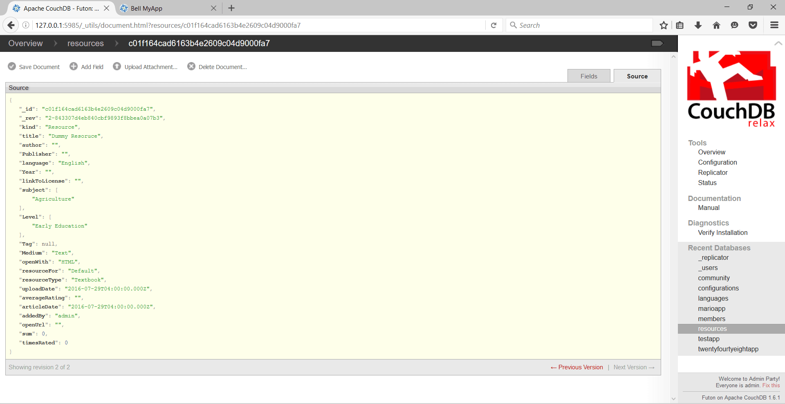
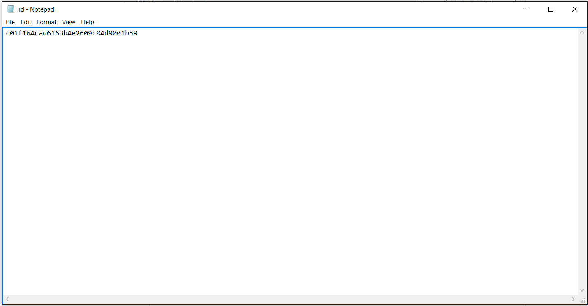
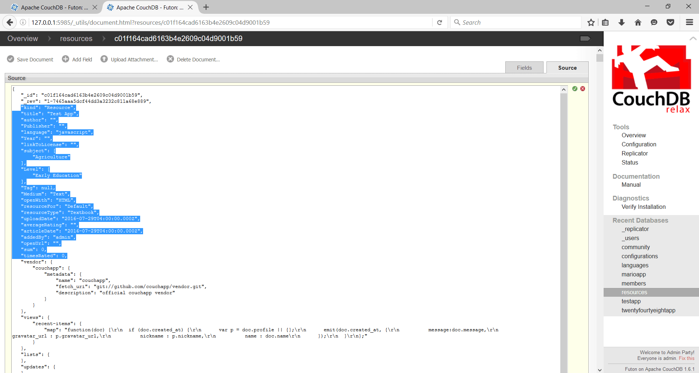
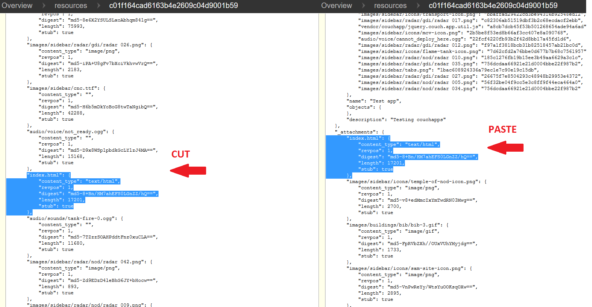
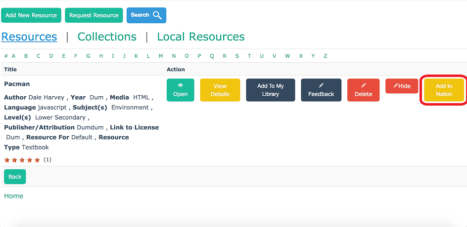
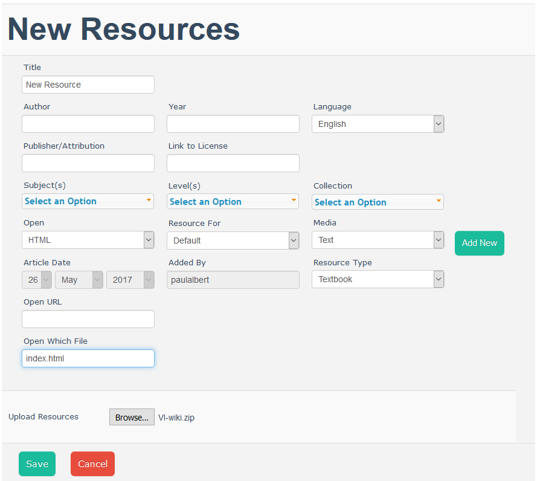

# HTML Resources

## Objective
Understanding of Couchdb database, Couchapp.
Find out HTML5 and Javascript applications to upload it into Bell app.
Adding resources to bell app library and make Bell much more interesting and interactive.

## Documentation
Documentation helps to understand overall progress of project. Visit following link to learn more about it.
[Documentation](https://docs.google.com/document/d/1aAzah833gWCQ2hWtGyMJLIK83nmunPJn42bnliLrxDk/edit?usp=sharing) and [Tips & Tricks](https://docs.google.com/document/d/1d5HZYSkiNKn0WCYAjAd3tvSC8QlBbyECnvhRqCphT4c/edit)

## Porting HTML App to CouchApp: 2 methods

The first way (which is a bit trickier and has more steps) will help you learn about how couchDB works, and how HTML apps work. After you familiarize yourself with that, the second way makes it easier because you can directly upload HTML apps to your BeLL app. Make sure to do method 1 before moving onto method 2.

## Method 1: Using CouchDB and CouchApp

Prerequisites:

* Python2 with pip and setuptools
* [Couchapp](htmlresources.md#Couchapp_Installation)
* Couchdb Instance
* Desired JavaScript/HTML application


## Couchapp Installation

#### Linux/OSX
Clone the [couchapp repository](https://github.com/couchapp/couchapp.git), build and install it. Run the following commands in the directory of your choice (from a terminal):

```
git clone https://github.com/couchapp/couchapp.git
cd couchapp
python setup.py build
sudo python setup.py install
```

_Note:_
If you get the error message that includes the line, `The program 'python' can be found in the following packages:`, then Python2 is not installed. To fix this you need to install the python package along with pip.

Enter the command:

`> sudo apt-get install python`

That should install python but you also need to install the package manager called pip, by typing:

`> sudo apt-get install python-pip`

Pip allows you to install the needed setuptools dependency for Couchapp but it also lets you install many more useful Python packages.

_Note:_
If you get an error message, `ImportError: No module named setuptools`, then we need to install  [setuptools](https://pypi.python.org/pypi/setuptools) first. This is a [common issue](https://www.google.com/search?num=100&q=ImportError:+No+module+named+setuptools), but is easily solved.

The following command should take care of this:

`> curl https://bootstrap.pypa.io/ez_setup.py -o - | python`

If the above command does not seem to work, you can also install setuptools by using the Python package manager called pip by doing the following command:

`> pip install setuptools`

Installing a package may need elevated privileges, so if you are receiving a permission denied error, it is likely you may need to use sudo and then type in the password to get sudo privileges. The command will look like this:

`> sudo pip install setuptools`

#### Windows
There are two possible methods for installing python. Method 1 requires you to install python and other prerequisites. Method 2 is a standalone .exe file. Method 2 is easier because it only requires one step, and the .exe file installs all necessary files for you.

*Method 1*

There's a good amount of prerequisites for the couchapp installation on Windows.

1. Download Python 2.7 [here](https://www.python.org/downloads/). This method only works with version 2.7. If you use a Python installer with a UI, select the option to add Python to PATH. If not (or if that doesn't work) follow [these instructions](https://docs.python.org/3/using/windows.html#excursus-setting-environment-variables). Test that Python is in your PATH with `python --version`.
2. Download setuptools by following the instructions for Windows [here](https://pypi.python.org/pypi/setuptools).
3. Download py2exe by following the instructions [here](https://pypi.python.org/pypi/py2exe/0.9.2.0/) (or [here](https://sourceforge.net/projects/py2exe/files/py2exe/0.6.9/) if you're using Python 2.7 or below).
4. Download pywin32 [here](https://sourceforge.net/projects/pywin32/files/pywin32/Build%20220/).
5. Download curl by opening powershell with admin access and typing `choco install curl`

Once you have all of these, clone the [couchapp repository](https://github.com/couchapp/couchapp.git), build and install it. Run the following commands in the directory of your choice (from a terminal):

```
git clone https://github.com/couchapp/couchapp.git
cd couchapp
python setup.py build
python setup.py install
```

Note:
Make sure to check for error messages (found at the bottom of the blocks of text created when running these commands) when building and installing the couchapp. For example, if you're using Python 2.7, you may be prompted to install the [Visual C++ Compiler](https://www.microsoft.com/en-us/download/details.aspx?id=44266). If you do get an error message, let us know in the Gitter chat, and we'll do our best to help you.

*Method 2*

Click [here](https://couchapp.readthedocs.io/en/latest/couchapp/install.html#installing-on-windows) and scroll down to the "Installing on Windows" section. Click on the first link 'Standalone Executable 1.0.2'. This will download the couchapp-1.0.2-win32.exe. Run the .exe file by double clicking it. When the installation is complete make sure the "Add couchapp to path" box is checked and finish the installation.

Note:
If you have windows 7  and you get an error message on the next step, you may need to install Visual C++ 9.0 [here](https://www.microsoft.com/en-us/download/details.aspx?id=44266). Then install 'http-parser' by typing into your terminal:

```
pip install http-parser
```

### Generating the couchapp
When using `couchapp generate` command you will be able to generate the structure of a basic couchapp. First, make sure you are in _couchapp_ folder. Then create a folder with the same app name you are making. Finally, change to that folder you just created. In this case I will guide you to create an app called *"test"* using the following commands.

```
$ mkdir test
$ cd test
$ couchapp generate test
```

If you see an error like the following

```
'couchapp' is not recognized as an internal or external command,
operable program or batch file.
```

It simply means that the _cmd_ couldn't locate the couchapp executable file. You can find the _couchapp_ executable in the **Scripts** folder of Python installation. When you add the **Scripts** folder's location to the Environment variables' PATH, _cmd_ will be able to find the _couchapp_ when you reference it. Now add **Scripts** folder in the Python installation to PATH, like you added Python to the PATH in the earlier steps. After adding this to the PATH restart your *cmd* and navigate to the **test** folder and run `couchapp generate test`.

After successfully executing the `couchapp generate test` command, the app called *"test"* is generated in your _couchapp_ directory.

```
$ couchapp generate test
[WARNING] "genrate app" will be deprecated in future release. Please use "init -t TEMPLATE" instead.
[INFO] /Users/ignacio/Desktop/ole/test created.
```


After you run it, you will need to edit the file `.couchapprc` in order to add the server path.

The file should be like the one shown below. In this file, `db` is the server path, in my case it is `http://127.0.0.1:5985`, followed by `testapp`. Where `testapp` is the database where I want to insert the app.

> The database name can only contain lowercase characters (a-z), digits (0-9), and any of the characters _, $, (, ), +, -, and / are allowed. It must begin with a letter.


```
{
    "env" : {
        "myserver" : {
            "db" : "http://127.0.0.1:5985/testapp"
        }
    }
}
```

Also you can edit some fields, like `name` and `description`  in the file `couchapp.json`

```
{
    "name": "Test app",
    "description": "Testing couchapps"
}
```

### Adding content to the app and pushing it
Now that you have generated the app, you will need to add the original app data (the one you're porting) to `_attachments` folder. You may want to remove everything inside that folder before you add the new content. You can remove all items inside it and copy the data with the following terminal commands:

```
rm -rf _attachments/*
cp -r /home/user/myoriginalapp/* _attachments/
```
Or for Windows:
```
rd /s /q c:\Users\%username%\couchapp\test\_attachments
md c:\Users\%username%\couchapp\test\_attachments
xcopy c:\Users\%username%\appIwantToTransfer c:\Users\%username%\couchapp\test\_attachments
```

Now that you have done all those steps, you will need to name the app as index.html and upload the app to the server: `couchapp push myserver` where `myserver` is the one you specified in the `.couchapprc` file.

```
$ couchapp push myserver
[INFO] Visit your CouchApp here:
http://127.0.0.1:5985/testapp/_design/test/index.html
```

After this, The app will be available on the specified link. You should be able to see the database in http://127.0.0.1:5985/_utils/database.html?testapp

## Adding the app as resource to Bell App Library

### Link Library resource to CouchDB database
The next step is to properly link a Library resource to the database containing the HTML app's data that you created.

First, you need to add a [New Dummy Resource](http://127.0.0.1:5985/apps/_design/bell/MyApp/index.html#resources) so it's easier to copy the template for resources into the actual new resource. Set the `Open` parameter to HTML, and write the additional info required, but don't attach any files.

Now we have to mess around with some things in the [CouchDB](http://127.0.0.1:5985/_utils/). For ease of viewing, make sure to change "Rows per page:" to 50 or higher. You can see the resource you just added in the database titled `resources`.



Next, go into the folder on your computer where your couchapp is located, go into the `.couchapprc` file, and change the value for `db` to ```"http://127.0.0.1:5985/resources"```. This changes the directory of the next `couchapp push` to the `resources` database.

Now we need a random `_id` value for the new Library resource. ```curl -X GET http://127.0.0.1:5985/_uuids``` will generate a random UUID. Copy that value from your command prompt/terminal and replace the value in the `_id` file with the random UUID.



Once these changes have been made, ```couchapp push myserver``` again. The app will be available at the URL specified.

This next part is the most complicated, so make sure to pay extra attention here. Go to the [CouchDB](http://127.0.0.1:5985/_utils/) and open the *dummy resource* you made in one tab and the *app you just pushed* in another tab (both of which can be found in the `resources` database). As you can see when you compare your app and the dummy resource, the app is missing fields that are necessary for it to be usable in the Library. So now, go to the dummy resource click the "Source" tab. Double-click the source and copy everything from the dummy resource EXCEPT the `_id` and `_rev` fields.


Then, go into the "Source" of your app and paste those fields below the `_rev` field. Remember to put a comma after the last line you paste (`"timesRated": 0`) and feel free to change the `title` field to the name of your app.



If you scroll down to the `_attachments` field, you'll find a reference to an .html file called `index.html` or `main.html` or something along those lines. Cut the reference and all of its info and put it at the beginning of the `_attachments` field like so:



Once you make these changes, click `Save Document`. You should now be able to find your app in the [Library](http://127.0.0.1:5985/apps/_design/bell/MyApp/index.html#resources)!

### Push New App to Nation
Now delete your dummy resource by clicking `Delete`. Then click `Open` on you html resource to test it out.


Finally, push your app to the nation by clicking `Add to Nation`.

_Note:_
Friendly reminder again to use Firefox when doing these steps or 'Add to Nation' may not appear in other browsers.



#### Useful Links
[What is Couchapp?](http://couchapp.readthedocs.io/en/latest/intro/what-is-couchapp.html)
[About CouchDB](http://couchdb.apache.org/)
[HTML5-Demos and Examples](http://html5demos.com/)
[HTML5 Apps-Open Source](https://github.com/leereilly/games#user-content-arcade)
___
## Method 2: uploading a zip file directly to the BeLL app

There is another way to upload an HTML app. Once you have downloaded the app to your computer, unzip it if it is zipped, and check if there are unnecessary files in the app (.git folder, node_modules, bower). If you're not sure, leave it in, but more files means longer upload. You won't always have these files- most of the time the .git folder only exists if you cloned a repository from GitHub or if it's a repository you created.

For Windows users, some folders may be hidden, so to show any hidden folders, follow the directions [here](https://support.microsoft.com/en-us/help/14201/windows-show-hidden-files).

Now you can zip the contents of your app. Select all files in your app and zip them into a folder. Be careful here- make sure you *don't* put the files into a folder and zip the folder. You must instead select all the files and zip those.

Once you have your zip folder, add your app as a resource like you did during the intern application process, but select HTML under Open and put the file name of the main page (i.e. index.html) in Open Which File like below:



Click save. Adding to your community will take some time (30 seconds - 5 minutes). Pushing to the nation will take even longer depending on your internet connection.

Post to gitter if it won't add to your community. Also check to see if index.html opens up the working app on your local machine. If it does, then you can always use method 1 to upload.
